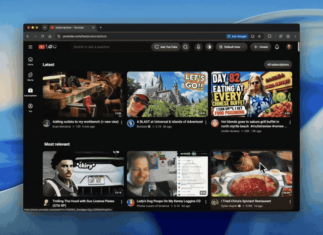
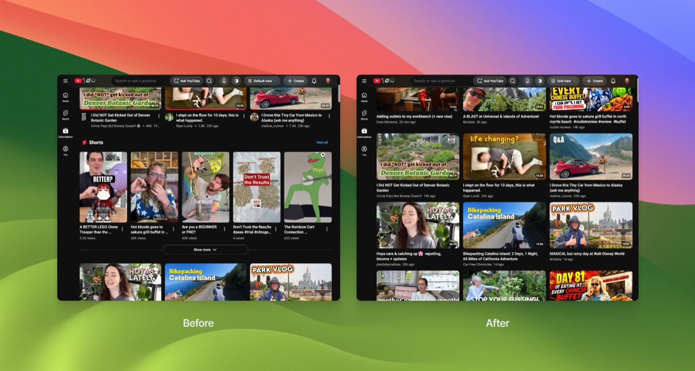
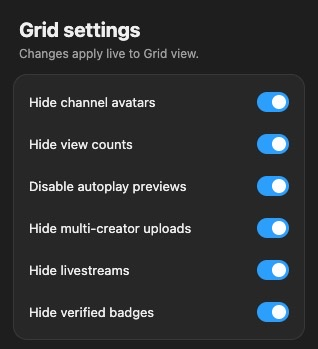

<h1 align="center">Subtle for YouTube</h1>

<strong>A minimal YouTube subscriptions feed that feels native.</strong>

  
  
  

  

Subtle for YouTube is a lightweight, open-source Chrome extension for the **desktop YouTube Subscriptions feed**. It adds three native-looking layouts and a focused set of controls directly to YouTube's interface.

Subtle works only on [`youtube.com/feed/subscriptions`](https://www.youtube.com/feed/subscriptions). The YouTube home page, player, search, and channel pages stay unchanged.

## Three feed modes

### Grid view

A clean, consistent three-column grid for browsing recent uploads. Grid view removes mixed shelves and supports optional focus controls.

### List view

A compact, title-first feed for scanning more uploads at once. It removes thumbnails and extra card chrome while keeping the channel, upload date, and duration visible.

### Default view

YouTube's original desktop Subscriptions layout. Switch back at any time without reloading the page.

## Focus controls

Grid view can be tailored to show only the information you care about.

  

- Remove Shorts and mixed-content shelves
- Hide livestreams, including completed uploads labeled “Streamed”
- Hide channel avatars, view counts, view icons, and verified badges
- Hide multi-creator and collaboration uploads
- Disable autoplay thumbnail previews

  

### Grayscale mode

Use the half-tone circle in YouTube's header to desaturate the Subscriptions page. Grayscale mode quiets colorful thumbnails and previews with one click, and it works independently of the selected feed layout.

## Designed to disappear

Subtle places its mode selector inside YouTube's existing desktop header and follows the site's spacing, typography, colors, menus, and light or dark theme. Changes apply instantly, with no separate dashboard. On narrow or mobile-sized windows, Subtle steps aside and restores YouTube's layout.

## Install

1. Download the ZIP from the [latest release](https://github.com/justintylerm/subtle-youtube/releases/latest).
2. Unzip it somewhere you plan to keep it.
3. Open `chrome://extensions` in Chrome.
4. Turn on **Developer mode**.
5. Choose **Load unpacked** and select the unzipped folder.
6. Open the [desktop YouTube Subscriptions feed](https://www.youtube.com/feed/subscriptions).

The header control switches feed modes. Open Subtle from Chrome's toolbar to customize Grid view.

## Privacy

Subtle has no analytics, ads, trackers, account access, or remote services. It stores only your display preferences in Chrome's local extension storage.

Read the full [privacy policy](PRIVACY.md).

## Browser and page support

- Google Chrome and Chromium-based desktop browsers
- YouTube's desktop Subscriptions page only
- Chrome Manifest V3

YouTube changes its page structure regularly. If something looks wrong, open an [issue](https://github.com/justintylerm/subtle-youtube/issues) with your browser version and a screenshot.

## Contributing

Subtle has no build step or runtime dependencies. Bug reports and focused pull requests are welcome. See [CONTRIBUTING.md](CONTRIBUTING.md) for the local development workflow.

## Disclaimer

Subtle for YouTube is an independent, open-source project and is not affiliated with, endorsed by, or sponsored by YouTube or Google. YouTube is a trademark of Google LLC.

## License

[MIT](LICENSE) © justintylerm
