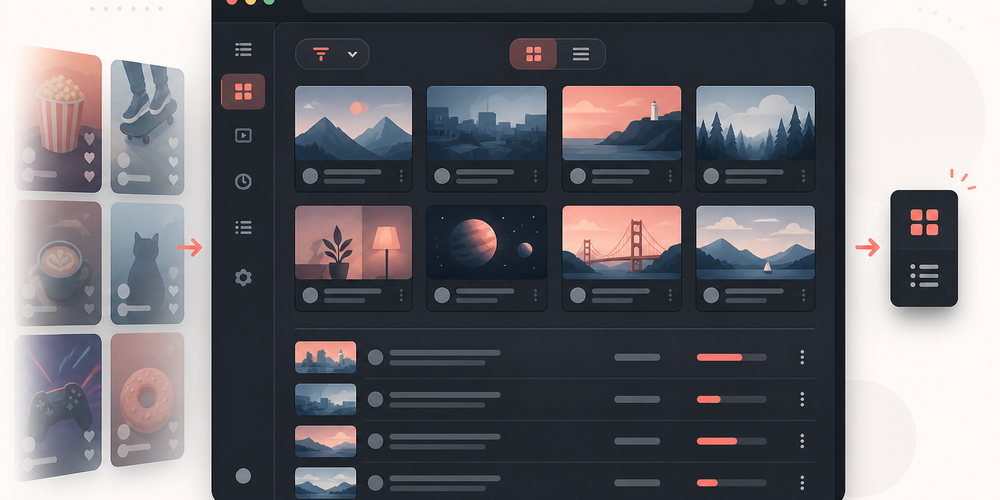

  

<h1 align="center">Latest Subs for YouTube</h1>

<strong>Watch what you chose. Skip the noise.</strong>

  
  
  

Latest Subs is a lightweight Chrome extension that turns the YouTube Subscriptions page into a calmer, more intentional feed. Choose a focused grid, a compact title-first list, or the untouched default layout—then hide the visual signals that pull attention away from the videos you actually subscribed to watch.

No account access. No analytics. No remote services. Your preferences stay in Chrome's local extension storage.

## Why it exists

Subscriptions should feel like an inbox from creators you chose, not another recommendation surface. Latest Subs removes Shorts shelves and other mixed-content sections from its focused views, reduces noisy metadata, and gives recent uploads a clear, predictable layout.

## Features

- **Three feed views:** focused 3-column Grid, compact List, or YouTube's untouched Default view
- **Shorts-free focused views:** hides Shorts shelves, mixed shelves, filter chips, and other feed interruptions
- **Flexible Grid settings:** independently hide channel avatars, view counts, autoplay previews, multi-creator uploads, livestreams, and verified badges
- **Grayscale mode:** quiet thumbnail colors when you want even less visual pull
- **Live updates:** changes apply immediately without reloading the page
- **Local-only preferences:** settings are stored on your device with `chrome.storage.local`
- **Minimal permissions:** only extension storage and access to `youtube.com`
- **Responsive safety:** custom layouts automatically step aside on narrow/mobile-sized windows

## Install

Latest Subs is currently distributed as an unpacked extension.

1. Download [`youtube-latest-subscriptions.zip`](https://github.com/justintylerm/youtube-latest-subscriptions/releases/latest/download/youtube-latest-subscriptions.zip) from the latest release.
2. Unzip it somewhere you plan to keep it.
3. Open `chrome://extensions` in Chrome.
4. Turn on **Developer mode**.
5. Choose **Load unpacked** and select the unzipped folder.
6. Open [YouTube Subscriptions](https://www.youtube.com/feed/subscriptions).

## Use

On the Subscriptions page, use the new control beside YouTube's top-right account controls to switch between:

- **Grid view** — a clean, consistent video grid
- **List view** — a dense, title-first feed with channel, date, and duration
- **Default view** — YouTube's original feed, unchanged

Use the half-tone circle button for grayscale thumbnails. Click the extension icon in Chrome's toolbar to fine-tune Grid view.

## Privacy

Latest Subs does not collect, transmit, sell, or share personal data. It does not read your Google account, browsing history, or video history. The extension changes the presentation of the YouTube Subscriptions page in your browser and stores only your display preferences locally.

Read the full [privacy policy](PRIVACY.md).

## Compatibility

- Chrome and Chromium-based desktop browsers
- YouTube's desktop Subscriptions page
- Manifest V3

YouTube changes its page structure regularly. If something looks wrong, open an [issue](https://github.com/justintylerm/youtube-latest-subscriptions/issues) with your browser version and a screenshot.

## Contributing

Bug reports and focused pull requests are welcome. See [CONTRIBUTING.md](CONTRIBUTING.md) for the quick-start workflow.

## Disclaimer

Latest Subs is an independent, open-source project and is not affiliated with, endorsed by, or sponsored by YouTube or Google. YouTube is a trademark of Google LLC.

## License

[MIT](LICENSE) © justintylerm
